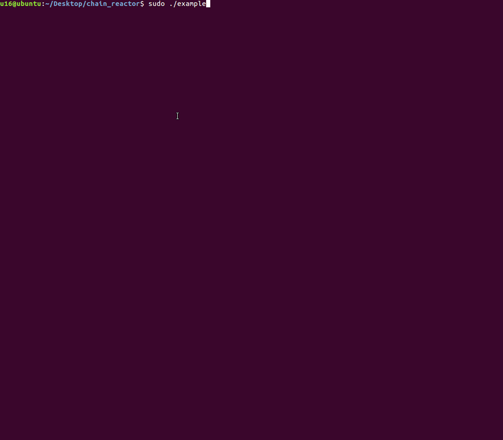

<p></p>

# Chain Reactor

Announcement blog post: https://redcanary.com/blog/chain-reactor-framework-for-linux/

Chain Reactor is an open source framework for composing executables that can
simulate adversary behaviors and techniques on __Linux__ endpoints. Executables can perform sequences of actions like process creation, network connections and more, through the simple configuration of a JSON file.

Chain Reactor assumes no prior engineering experience and can easily leverage tests or techniques from [Atomic Red Team](https://atomicredteam.io/) and [MITRE ATT&CK](https://attack.mitre.org/).


<p></p>

# How does it work?

Chain Reactor is responsible for running a `reaction`, which is composed of a
list of objectives, called `atoms`. Each `atom` can contain one or many actions,
called `quarks`. Quarks specify the action to take and the subsequent arguments
to use.

While this might sound complex at first, this structure helps with pre-stage
setup, multi-stage objectives, and post-stage cleanup.

# Getting Started

Chain Reactor requires `python3`.

Install dependencies:

Debian:
```
sudo apt install musl-tools
```

RPM:
```
sudo yum install musl-tools
```

*Note: If your repository system doesn't contain musl-tools, you can build it from source:*

```
git clone git://git.musl-libc.org/musl
cd musl && ./configure && sudo make install
```

Build Chain Reactor:
```
make
```

# An illustrative example

Let’s start with a basic chain reaction:

`reaction.json`

```
{
    "name": "simple_reaction",
    "atoms": [
        "HIDDEN-PROCESS-EXEC"
    ]
}
```

`atoms.json`

```
[
    {
        "name" : "HIDDEN-PROCESS-EXEC",
        "execve" : [ "mkdir", "-p", "/tmp/.hidden" ],
        "copy" : [ "/proc/self/exe", "/tmp/.hidden/.chain_reactor_hidden" ],
        "execveat" : [ "/tmp/.hidden/.chain_reactor_hidden", "exit" ],
        "remove" : [ "/tmp/.hidden" ]
    }
]
```

To build the ELF executable, we run the following:

`python3 compose_reaction atoms.json reaction.json <output_name_for_executable>`

The details:
- The chain reaction `simple_reaction` is composed of one objective (atom) called `HIDDEN-PROCESS-EXEC`.
- This atom is composed of four actions (quarks).
- The first quark utilizes the [execve](http://man7.org/linux/man-pages/man2/execve.2.html) system call to create a hidden directory.
- The second quark utilizes a built-in function to copy the current running chain reactor process (`/proc/self/exe`) to the newly created hidden directory as a hidden file.
- The third quark utilizes a different system call, [execveat](http://man7.org/linux/man-pages/man2/execveat.2.html), to execute the hidden chain reactor binary. The `exit` argument instructs the newly created chain reactor process to exit without performing additional operations.
- The fourth quark deletes the hidden directory and hidden file.

Here are some questions this chain reaction can help you answer:
- *Visibility*: Does my endpoint security product collect telemetry for all four quarks? Does it handle one, many, or all system calls that can be used to execute a binary?
- *Detection*: Does my endpoint security product alert me to the execution of a hidden binary in a hidden directory?

# Documentation

Additional details about `reactions`, `atoms`, and `quarks` can be found [here](docs/README.md)
